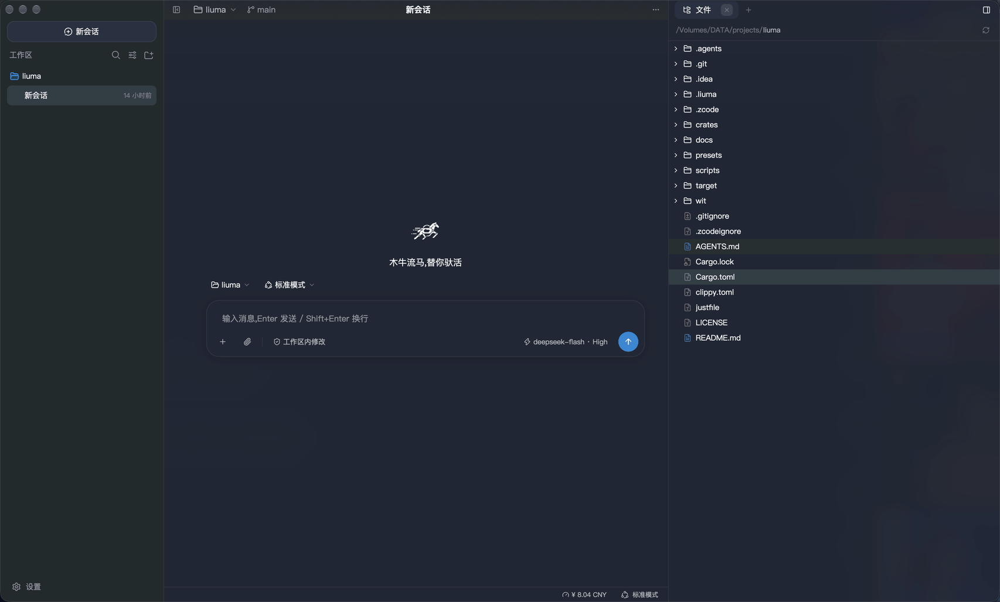

<div align="center">
  
  <h1>流马 liuma</h1>
</div>

流马 liuma 是一个本地运行的 AI 编程智能体:接入多家大模型,驱动多轮对话与工具执行;工具在受控沙箱中安全运行,全过程完整记录、可回放;附桌面客户端。取名自木牛流马:不食不眠、自行运转的运输 agent。

项目起步阶段参照 [DeepSeek Harness](https://github.com/deepseek-ai/deepseek-harness) 的开发快照设计部分语义。



## 特性

- **事件溯源**:会话全部状态是追加式 JSONL 事件日志;模型历史、审计、遥测均为投影,同一日志任意时刻重放结果一致,崩溃后从日志恢复。
- **结构性不变式**:「模型可见 ⟺ 已记录」由不变式闸门在唯一出网点强制,不依赖调用方自律;沙箱不可用即拒绝执行。
- **WASM 组件工具**:接口以 WIT 契约定义(`wit/`),wasmtime 运行;组件权限由能力束显式界定,时钟与随机源显式注入保证重放确定性。
- **沙箱执行**:macOS Seatbelt / Linux Landlock / bubblewrap / Windows 受限令牌 + 能力 SID 授权沙箱链(fail-closed);权限三态 + 审批门(ask / never)。
- **原生桌面客户端**:GPUI 桌面端(聊天 / 计划审批 / 问答卡 / 轨迹检查器 / 全文检索 / 会话导出),另有 `liuma` CLI(REPL / JSON-RPC stdio 网关)。

## 快速开始

要求 Rust 1.97+(edition 2024)。

```bash
# 不联网自检(fake provider,脚本化回声)
cargo run -p liuma -- chat --fake

# 接真实 provider(缺省读 DEEPSEEK_API_KEY;--dialect 可切 anthropic / openai-chat 等)
cargo run -p liuma -- chat

# JSON-RPC stdio 网关
cargo run -p liuma -- serve

# GPUI 桌面客户端
just desktop-run        # 参数透传,如 just desktop-run --fake
```

## 验证

```bash
just verify    # 格式 / clippy / 测试 / WIT / 组件契约 / e2e / 链接检查
```

## 仓库布局

| 路径 | 职责 |
|---|---|
| `wit/` | 契约层,全部 WIT 包的唯一契约源 |
| `crates/liuma` | 宿主二进制(CLI 薄壳) |
| `crates/liuma-app` | 会话装配层(配置合并 / prompt 组装 / preset 工具组装) |
| `crates/liuma-core` | 多会话应用核心(注册表 / 客方协议类型 / 轨迹与统计投影) |
| `crates/liuma-desktop` | GPUI 桌面客户端 |
| `crates/liuma-host` | 组件宿主(wasmtime 组件管理器 / 事件总线 / 持久化 / 网关) |
| `crates/liuma-llm` | LLM 接入(方言引擎 / HTTP+SSE transport / 不变式闸门) |
| `crates/liuma-sandbox` | 执行原语(沙箱链 / 受控 spawn / PTY) |
| `crates/liuma-agent-loop` | turn/step 状态机与端口 trait |
| `crates/liuma-session` | 事件日志(信封 / seq / 消息派生,wasm32-wasip2 产物 + rlib) |
| `crates/liuma-attachment` | 附件存储与准入(内容寻址存储 / 图片解码 / 粘贴与拖放准入链) |
| `crates/liuma-prompt` | system prompt 组装(纯函数) |
| `crates/liuma-hooks` | hooks 桥(Claude Code / Codex shell hooks 接入) |
| `crates/liuma-mcp` | MCP client 桥(rmcp;stdio + streamable-http 双传输 / 断线重连 / 工具桥接) |
| `crates/liuma-skill` | Skill 子系统(`.agents/skills` 目录加载 / 渐进披露 / skill 工具) |
| `crates/liuma-tools` | 工具注册表与内置工具 |
| `crates/liuma-wit` | host 侧 bindgen 与组件契约测试 |
| `crates/liuma-example-tool` | 示例工具组件(`liuma:tools` world 参考实现) |
| `presets/` | 内置能力 preset manifest(standard / minimal) |
| `scripts/` | verify 脚本 |

## 文档

- [docs/design.md](docs/design.md) —— 设计文档(质量目标 / 架构约束 / 构件与运行视图 / 横切概念 / 术语表)
- [docs/plugin-sdk.md](docs/plugin-sdk.md) —— 插件 SDK
- [wit/](wit) —— WIT 契约定义

## 许可证

[MIT](LICENSE)
