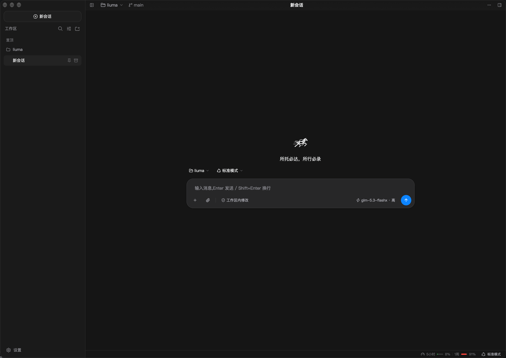

[English](README.md) | 简体中文

<div align="center">
  
  <h1>流马 liuma</h1>
</div>

[](https://github.com/leexbo/liuma/actions/workflows/ci.yml)
[](LICENSE)

流马 liuma 是一个本地运行的 AI 编程智能体:接入多家大模型,驱动多轮对话与工具执行;工具在受控沙箱中安全运行,全过程完整记录、可回放;附桌面客户端。取名自木牛流马:不食不眠、自行运转的运输 agent。

项目起步阶段参照 [DeepSeek Harness](https://github.com/deepseek-ai/deepseek-harness) 的开发快照设计部分语义。



## 特性

- **事件溯源**:会话全部状态是追加式 JSONL 事件日志;模型历史、审计、遥测均为投影,同一日志任意时刻重放结果一致,崩溃后从日志恢复。
- **结构性不变式**:「模型可见 ⟺ 已记录」由不变式闸门在唯一出网点强制,不依赖调用方自律;沙箱不可用即拒绝执行。
- **WASM 组件工具**:接口以 WIT 契约定义(`wit/`),wasmtime 运行;组件权限由能力束显式界定,时钟与随机源显式注入保证重放确定性。
- **沙箱执行**:macOS Seatbelt / Linux Landlock / bubblewrap / Windows 受限令牌 + 能力 SID 授权沙箱链(fail-closed);权限三态 + 审批门(ask / never)。
- **决策模型接入**:按开放品类接入 System One 决策模型(`noul` / `choice` / `score` 三类问题,返回约束在预声明选项内的结构化答案),覆盖审批评审员 / Stop 哨兵 / 工具守卫 / 上下文裁判四个场景,外加一个 `decide` 工具供模型主动咨询。阈值与问题文案集中一处便于人审;默认全关、只建议不自动执行、服务不可用即回退原有行为,每次询问留审计记录(设置页「决策模型」区唯一配置面)。
- **原生桌面客户端**:GPUI 桌面端(聊天 / 计划审批 / 问答卡 / 轨迹检查器 / 全文检索 / 会话导出),另有 `liuma` CLI(REPL / JSON-RPC stdio 网关)。

## 快速开始

前置依赖(用 `just preflight` 自检缺件,它会逐项打印安装命令):

| 依赖 | 用途与安装 |
|---|---|
| Rust 1.99+ | 定版见 `rust-toolchain.toml`;Unix `curl --proto '=https' --tlsv1.2 -sSf https://sh.rustup.rs \| sh`,Windows 用 [rustup](https://rustup.rs) |
| `wasm32-wasip2` 目标 | 组件契约测试要真编译 wasm 组件:`rustup target add wasm32-wasip2` |
| `just` | 命令入口:`cargo install just` / `brew install just` / `winget install Casey.Just` |
| 真 Python 3 | `scripts/verify-links` 与 MCP fixture 需要;Unix `brew install python3` / `apt install python3`,Windows `winget install --id Python.Python.3.13` |
| `bash` | Unix 自带;Windows 用 Git for Windows 自带的那份 |

Windows 另需 `pwsh`(shell 工具的运行时):`winget install --id Microsoft.PowerShell`。Microsoft Store 的 `python3` 只是应用执行别名(命令存在、运行即退出 49),不算真解释器。

```bash
git clone git@github.com:leexbo/liuma.git && cd liuma
just preflight    # 开发前置自检:缺什么、怎么装,一次说清
```

构建:

```bash
cargo build --workspace    # 全部 crate;首次构建含 wasm 组件与桌面端,耗时较长
just desktop               # 只构建 GPUI 桌面客户端
```

运行:

```bash
# 不联网自检(fake provider,脚本化回声)
cargo run -p liuma -- chat --fake

# 接真实 provider(缺省读 DEEPSEEK_API_KEY;--dialect 可切 anthropic / openai-chat 等)
cargo run -p liuma -- chat

# JSON-RPC stdio 网关
cargo run -p liuma -- serve

# GPUI 桌面客户端
just desktop-run        # 参数透传,如 just desktop-run --fake
```

## macOS 应用打包

```bash
just package-macos    # 产出 dist/Liuma.app + zip + dmg(仅 Darwin)
```

release 构建(Liuma-\<版本\>-\<架构\>.zip / .dmg,版本号取自根 `Cargo.toml`)加 ad-hoc 签名,本机直接可用;未经公证,分发给他人时 Gatekeeper 首次打开需右键打开或 `xattr -cr`。应用图标与运行时 Dock 图标同源:由 `logo.svg` 经 resvg 离线栅格化(`examples/emit-app-icon`)+ `iconutil` 出 `.icns`;bundle 模板见 `crates/liuma-desktop/packaging/`。

打包链路目前仅覆盖 macOS,Windows / Linux 平台尚未适配。

## 验证

```bash
just verify    # 格式 / clippy / 测试 / WIT / 组件契约 / e2e / 链接检查 / 桌面文案
```

## 仓库布局

| 路径 | 职责 |
|---|---|
| `wit/` | 契约层,全部 WIT 包的唯一契约源 |
| `crates/liuma` | 宿主二进制(CLI 薄壳) |
| `crates/liuma-app` | 会话装配层(配置合并 / prompt 组装 / preset 工具组装) |
| `crates/liuma-core` | 多会话应用核心(注册表 / 客方协议类型 / 轨迹与统计投影) |
| `crates/liuma-desktop` | GPUI 桌面客户端 |
| `crates/liuma-desktop/packaging/` | macOS bundle 模板(Info.plist) |
| `crates/liuma-host` | 组件宿主(wasmtime 组件管理器 / 事件总线 / 持久化 / 网关) |
| `crates/liuma-llm` | LLM 接入(方言引擎 / HTTP+SSE transport / 不变式闸门) |
| `crates/liuma-sandbox` | 执行原语(沙箱链 / 受控 spawn / PTY) |
| `crates/liuma-sandbox-winacl` | Windows 沙箱后端(受限令牌 + 能力 SID 授权 + Job Object) |
| `crates/liuma-agent-loop` | turn/step 状态机与端口 trait |
| `crates/liuma-compaction` | 上下文压缩策略(纯函数:阈值 / 保留尾 / 切点不拆 tool 配对) |
| `crates/liuma-plan` | plan 模式协作状态(逐 agent 布尔态 + `exit_plan_mode` 阻塞评审) |
| `crates/liuma-session` | 事件日志(信封 / seq / 消息派生,wasm32-wasip2 产物 + rlib) |
| `crates/liuma-attachment` | 附件存储与准入(内容寻址存储 / 图片解码 / 粘贴与拖放准入链) |
| `crates/liuma-prompt` | system prompt 组装(纯函数) |
| `crates/liuma-hooks` | hooks 桥(Claude Code / Codex shell hooks 接入) |
| `crates/liuma-mcp` | MCP client 桥(rmcp;stdio + streamable-http 双传输 / 断线重连 / 工具桥接) |
| `crates/liuma-decision` | 决策模型接入(System One 协议 / 四场景策略 / `decide` 工具) |
| `crates/liuma-skill` | Skill 子系统(`.agents/skills` 目录加载 / 渐进披露 / skill 工具) |
| `crates/liuma-tools` | 工具注册表与内置工具 |
| `crates/liuma-wit` | host 侧 bindgen 与组件契约测试 |
| `crates/liuma-example-tool` | 示例工具组件(`liuma:tools` world 参考实现) |
| `presets/` | 内置能力 preset manifest(standard / minimal) |
| `scripts/` | verify 与打包脚本 |

## 文档

- [docs/design.md](docs/design.md) —— 设计文档(质量目标 / 架构约束 / 构件与运行视图 / 横切概念 / 术语表)
- [docs/plugin-sdk.md](docs/plugin-sdk.md) —— 插件 SDK
- [wit/](wit) —— WIT 契约定义

## 许可证

[MIT](LICENSE)
