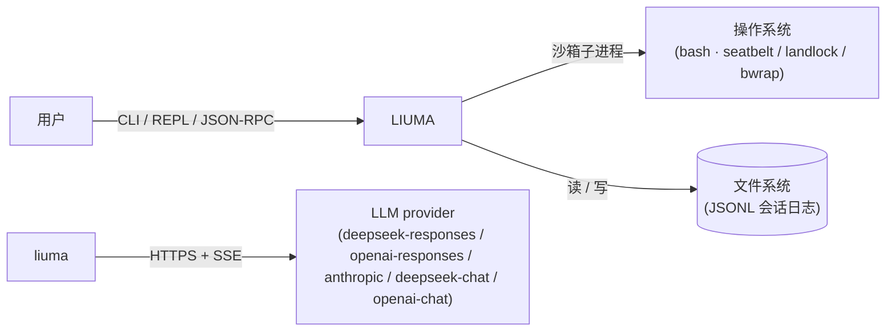
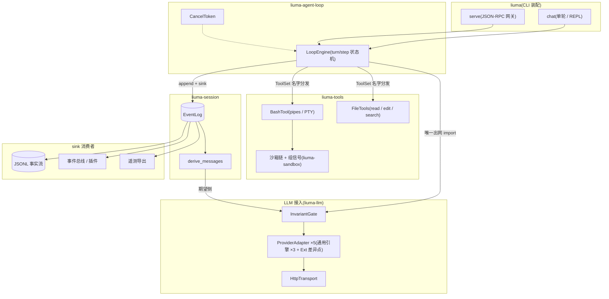
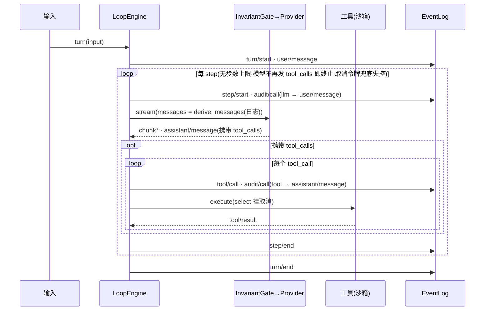

# liuma 设计文档

## 1. 引言与质量目标

liuma 是 agent harness:驱动 LLM 多轮对话与工具执行,以事件日志为会话的唯一事实源。宿主为原生 Rust(wasmtime 47+),会话组件产物目标 `wasm32-wasip2`,接口按 WASI 0.3 形状定义。

质量目标(按重要性排序):

| # | 质量属性 | 场景 |
|---|---|---|
| 1 | 正确性 | 模型收到的请求与日志派生不一致时,调用被拒绝——不依赖调用方自律 |
| 2 | 可重放 | 同一日志任意时刻重放,状态与派生 bit-exact;崩溃后从日志恢复 |
| 3 | 安全 | 沙箱不可用即拒绝工具执行;组件权限由能力束显式界定 |
| 4 | 可审计 | 每次跨边界调用可归因到触发它的会话事件 |
| 5 | 可扩展 | 新增 provider / 插件 / 事件类型不修改核心路径 |

## 2. 架构约束

| 约束 | 类型 | 内容 |
|---|---|---|
| C1 | 技术 | 组件运行于 wasmtime 47+,产物目标 `wasm32-wasip2`;Rust→wasm 工具链尚无 0.3 编译目标 |
| C2 | 技术 | 组件内不可达时钟与随机源(重放确定性要求其显式注入) |
| C3 | 组织 | 接口变更单向:契约(`wit/`)→ bindgen → 实现 |
| C4 | 安全 | 沙箱与一切校验 fail-closed:失败显式拒绝,不静默降级 |
| C5 | 组织 | 依赖版本 workspace 级锁定,升级独立 PR |

## 3. 系统上下文与范围



**范围**:单机会话引擎——对话循环、工具执行、事件持久化、审计、stdio 互操作。会话日志存于 `<LIUMA_HOME\|~/.liuma>/sessions/<projectKey(workspace)>/<sessionId>/session.jsonl`(`projectKey` = 路径分隔符折叠为 `-` 并包 `--…--`;独立目录名防与其他宿主混存;旧布局(工作区根/工作区 `.liuma`)启动时幂等迁移)。

**Non-Goals**(明确不做):多机分布式会话;自带观测后端(OTLP 仅留接缝);沙箱逃逸防御以外的系统级隔离(容器/VM);LLM 训练与缓存;web/浏览器前端(UI 仅保留 GPUI 桌面客户端,stdio 网关保留通道抽象)。

## 4. 解决方案策略

四条根本决策,系统的其余部分是它们的展开:

1. **事件溯源:日志是唯一事实源。** 会话的全部状态是追加式事件日志;模型历史、审计、遥测、终端渲染都是投影。状态只有一份,派生有唯一实现。
2. **不变式置于结构性边界。** 「模型可见 ⟺ 已记录」由宿主闸门在唯一出网点强制;沙箱不可用即拒绝执行;确定性由注入强制。规则放在无法被绕过的位置,而非约定。
3. **能力即束。** 权限是随执行世界传递的数据(cwd + 可写根 + 取消令牌),窄化传递即子环境边界;不做散落各处的运行前检查。
4. **一切皆插件:核心无特权。** 能力一律注册,核心只依赖端口——provider 是注册的 `ProviderAdapter`,工具是实现 `ToolPort` 的注册方,插件是总线订阅加生命周期,日志后端实现 `LogBackend`,传输实现 `LlmTransport`。核心路径(日志、闸门、状态机)不出现任何具体能力的名字;装配决定具体实现,扩展等于注册,不等于修改。宿主拥有原语,但原语本身也在 trait 之后。端口定义在组件侧(liuma-agent-loop,对应 WIT import),宿主实现分属 `liuma-llm`(LLM transport / provider 方言)与 `liuma-sandbox`(沙箱 / spawn / PTY)——替换实现 = 换 crate 依赖,不触碰宿主核心。
5. **契约超前,产物保守。** 接口按 WASI 0.3 形状定义,产物走 0.2 目标;切换发生时无迁移债务。

## 5. 构件视图

### 5.1 白盒:liuma 系统



依赖方向:`liuma` → `liuma-host` → `liuma-agent-loop` → `liuma-session`;`liuma-tools` 依赖 liuma-host 与 agent-loop;LLM 接入(`liuma-llm`)与执行原语(`liuma-sandbox`)是宿主侧的独立能力 crate——替换 provider / 沙箱实现 = 换 crate 依赖,不触碰核心;契约层(`wit/`)独立于全部 crate。

### 5.2 构件职责

| 构件 | 职责 | 对外接口 |
|---|---|---|
| `liuma` | CLI 入口(薄壳):参数解析、终端渲染(REPL/Reporter)、stdio 网关装配 | `chat` / `serve` / `info` 子命令 |
| `liuma-app` | 会话装配层:配置合并、prompt 组装、transport 构建、preset 工具组装、`Session`(turn 驱动 + 会话级事件)、日志重载 | 库 API |
| `liuma-core` | 多会话应用核心:多会话注册表(worker/队列/turn 内计划评审)、客方线上协议类型、事件翻译(我方词汇 → 客方 SessionEvent)、轨迹/统计/上下文投影;构建于 `liuma-app` 之上(单会话装配 ↔ 多会话核心的分工) | 库 API(`liuma-desktop` 进程内直连) |
| `liuma-desktop` | 桌面客户端(GPUI 原生 UI,gpui-component):进程内直连 `liuma-core` AppHost(同步方法直调/异步经 tokio runtime,mux+host 广播帧经 futures channel 桥入 GPUI),唯一 UI 客户端;关窗即退出 | `liuma-desktop [--workspace <dir>] [--fake]` |
| `liuma-host` | 组件宿主:wasmtime 组件管理器、事件总线与插件、持久化(JSONL/turso)、总线 transport、rpc 网关、遥测、配置/preset | 库 API(LLM 接入见 liuma-llm,执行原语见 liuma-sandbox) |
| `liuma-llm` | LLM 接入:通用方言引擎(chat/responses/anthropic)+ Ext 差异点(deepseek-responses / openai-responses / anthropic / deepseek-chat / openai-chat)、HTTP/SSE transport、不变式闸门(InvariantGate)、假 provider 测试装备 | 库 API;扩展点 `ProviderAdapter` / `FrameMapper` / `ChatExt` / `ResponsesExt` / `AnthropicExt` |
| `liuma-sandbox` | 执行原语:沙箱链(fail-closed)、受控 spawn/PTY(独立进程组、SIGTERM→grace→SIGKILL) | 库 API |
| `liuma-agent-loop` | turn/step 状态机;驱动端口定义 | `LlmTransport` / `Summarizer` / `ToolPort` / `ToolSet`(名字分发)/ `CancelToken`(trait 由宿主实现) |
| `liuma-compaction` | 上下文压缩策略(纯函数):压力阈值/保留尾 token 预算(0.8/0.16×窗口)、压缩范围选段(tool 配对平衡切点)、checkpoint 摘要指令(照源 compaction 包族语义) | 纯函数(select_range / measure_tokens / COMPACTION_INSTRUCTION) |
| `liuma-plan` | 计划模式协作状态(照源 packages/plan 包边界):状态折叠(模式/待审/活跃计划)、plan:policy 提示词段、exit_plan_mode 工具(turn 内阻塞评审,`^#\\s+\\S` 标题校验)、PlanReviewPort(宿主面:liuma-core/Gateway/CLI)、事件信封构造与载荷校验 | `PlanTool` / `PlanReviewPort` / `header_sections` / 纯函数 fold |
| `liuma-session` | 事件日志:信封、类型、seq 强制、消息派生、归因查询 | rlib API + WIT `liuma:session` 导出 |
| `liuma-prompt` | system prompt 组装(纯函数;宿主注入身份/环境/指令文件内容;plan 段由 liuma-plan 预渲染注入) | `assemble(ctx)` |
| `liuma-tools` | BashTool(沙箱执行、取消、PTY)+ FileTools(file_read / file_edit / file_search——检索为 ripgrep 引擎:ignore 遍历尊重 .gitignore,grep-searcher 行搜索)+ TodoTool(todo/state)+ GoalTool(goal/state)+ SubagentTool(嵌套引擎,独立子日志,能力束窄化)+ SubagentControlTool + JobTool(后台任务 list/read/stop;输出落盘 .liuma/jobs) | `ToolPort` 实现 |
| `liuma-mcp` | MCP client 桥:stdio server 连接(后台任务,不阻塞装配)与工具桥接(公共名 `mcp__<server>__<tool>`、raw name 走线、整代原子换带、list_changed 重同步、内容投影) | `McpServerPort`(ToolPort 实现) |
| `liuma-wit` | host 侧 bindgen 与组件契约测试 | 测试套件 |
| `liuma-example-tool` | 示例工具组件(echo_config / spin):`liuma:tools` world 参考实现与测试物料(rlib + wasm32-wasip2 双产物,照 liuma-session 模式) | WIT `liuma:tools` 导出 |
| `wit/` | 全部契约定义,唯一契约源 | 七个 WIT 包(§7.6) |

### 5.3 仓库布局

```
wit/                      契约层(liuma:json/session/loop/events/host/plugin/tools)
crates/liuma/               宿主二进制(CLI 薄壳)
crates/liuma-app/           会话装配层
crates/liuma-desktop/       GPUI 桌面客户端(进程内直连 liuma-core 宿主;唯一 UI 客户端)
crates/liuma-core/          多会话应用核心(注册表/协议类型/事件翻译/轨迹/统计/上下文)
crates/liuma-host/          组件宿主(组件管理器/总线/持久化/网关/遥测)
crates/liuma-llm/           LLM 接入(provider 方言/HTTP/SSE/不变式闸门)
crates/liuma-sandbox/       执行原语(沙箱链/进程/PTY)
crates/liuma-wit/           host bindgen + 组件契约测试
crates/liuma-session/       事件日志组件(wasm32-wasip2 产物 + rlib)
crates/liuma-agent-loop/    turn 引擎 + 端口 trait
crates/liuma-compaction/    上下文压缩策略(阈值/选段/摘要指令,纯函数)
crates/liuma-prompt/        prompt 组装
crates/liuma-tools/         工具注册表与内置工具(含 BashTool)
crates/liuma-example-tool/  示例工具组件(liuma:tools 参考实现,测试物料)
presets/                  内置能力 preset manifest(standard / minimal,YAML,编译进二进制)
scripts/                  verify-* 脚本
```

## 6. 运行视图

### 6.1 场景:turn 与工具执行



每个事件 append 后同步触发 sink(落盘 / 下行 / 渲染),再进入后续处理——「记录优先」。请求 messages 的唯一来源是 `derive_messages(日志)`;工具失败不中断循环。

### 6.2 场景:取消

软取消(CancelToken)在三个安全点生效:step 边界、出网返回后、工具执行前;触发即 `turn/end {cancelled:"token"}`。工具执行中由 select 中止:杀子进程 → 失败 tool/result → 循环继续。硬取消兜底:epoch deadline 超时即销毁竞技场,fuel 防计算 DoS。

### 6.3 场景:崩溃恢复 / 重放

JSONL 日志逐事件重放:信封校验(§7.1)通过即重建 EventLog,`derive_messages` 恢复模型历史,归因链恢复审计。竞技场可销毁并重放到任意 seq 再继续;成本 O(会话长度)。

### 6.4 场景:网关并发

`liuma serve` 中 turn 后台执行,读端不被长 turn 阻塞;`cancel` 请求在 turn 执行期间可到达并触发软取消。事件通知与响应经同一 FIFO 下行通道写出(顺序 = 事件发生顺序);通道抽象与传输无关,写端可替换为 WebSocket。

### 6.5 场景:桌面会话(liuma-desktop)

`liuma-desktop` 在自身进程内直接构造 `liuma-core` 的 `AppHost`(专任 tokio runtime):同步方法直调、异步方法经 runtime 派发,mux/host 广播帧经 futures channel 桥入 GPUI 事件循环——无 loopback HTTP/WS,无序列化往返。UI = 事件投影:GPUI reducer 与 Rust 翻译表(`liuma-core/src/translate.rs`)同仓同源;历史回填与直播共用 `session.history` 分页重放 + `session/subscribed` 基线;计划审批 = `question/requested` 帧接管 composer → `respond` → `question/resolved`。队列/steer:提交 mode=queue|steer,队列瞬态经 `session/queue` 帧整表下发(queued + steering 两种 placement,基线随 subscribed 重推),steer 认领落 `agent/inbox/spliced`(inserted+removed 双 splice,id 与 user/message 同源),`session.updateQueue` 变更 edit/remove/steer;`session.export` 返回原始会话 JSONL。轨迹台账(`trajectory_page` 读取面)与直播(`trajectory/delta` 帧)同源:宿主槽位驻留增量折叠器(`TrajectoryFolder`,逐事件 feed,驱动 turn sink 单写,attach 暖机 + RPC 读前兜底补喂,seq 连续性自愈),批量折叠即其包装——`trajectory/delta` 载荷 = 变更缓冲(records 按 index、requests 按 number 的 upsert 全量对象 + total + lastSeq),桌面不管面板可见与否直接应用;基线拉取与增量的竞态以「拉取发起时记录增量计数、回包落库时已前进即重拉」收敛。


## 7. 横切概念

### 7.1 事件模型

信封:`{ type, seq, time, data, surface_op?, source_event_seqs?, ignorable }`

| 字段 | 类型 | 约束 |
|---|---|---|
| type | string | 在已登记类型表中,或 `ignorable = true` |
| seq | u64 | 从 1 起连续;写入方运行时强制 |
| time | i64(ms) | 注入时钟产生 |
| surface_op | string? | 仅 surface 事件 |
| source_event_seqs | [u64]? | 仅归因集内事件;引用已存在的 seq |
| ignorable | bool | 缺省 false |

事件类型与分类:

| 类型 | 分类 | 载荷要点 |
|---|---|---|
| session/start · turn/start · turn/end · step/start · step/end | 骨架 | turn/end 可携带 `cancelled` |
| user/message | surface | `content` |
| assistant/message | surface | `content` + 可选 `tool_calls`(扁平 `{id, name, arguments}`) |
| tool/result | surface | `call`(tool/call 的 seq)、`id`(provider 调用标识)、`output`、`success` |
| tool/call | 簿记 | `name` + `arguments` |
| assistant/chunk | ignorable | `delta` |
| audit/call | 可归因 | `boundary`(llm/tool/process)、`operation`、`detail` |
| todo/state | 簿记 | `todos` 全量快照(id/task/status);恢复 = 读最近一条 |
| compaction/summary | 簿记 | `summary`、`throughSeq`(折叠覆盖边界);重放读记录不重调 |
| session/mode | 簿记 | `mode`(standard / plan);影响 prompt → 必须入日志 |
| plan/submitted | 簿记 | `plan`;模型经 exit_plan_mode 提交(turn 内评审发起时落档) |
| plan/approved | 簿记 | `plan`;批准后注入 active-plan 段,session/mode 回 standard |
| plan/declined | 簿记 | `plan` + 可选 `feedback`;拒绝留在 plan 模式,反馈经 tool/result 回传模型 |
| plan/cancelled | 簿记 | `plan`;评审被关闭/中断(等待用户在聊天中说话) |
| goal/state | 簿记 | `goals` 全量快照(id/text/done);恢复 = 读最近一条 |
| approval/asked · approval/decided | 簿记 | 沙箱升级审计对:`id` 配对;asked 带 `toolName`/`reason`,decided 带 `outcome`(allowed-once / rejected / cancelled / unavailable) |

归因集 = surface 三类 + audit/call。

读取方校验(全部 fail-closed):

| 违例 | 处置 |
|---|---|
| 格式版本不匹配 | 拒绝,不迁移 |
| seq 不连续 | 拒绝 |
| 未知类型且未标 ignorable | 拒绝重建 |
| 不可归因事件携带 source_event_seqs | 拒绝 |
| 未知类型且 ignorable | 跳过并保留载荷(前向兼容) |

### 7.2 消息派生

`message_from_event` 是「事件 → 消息」的裸映射:user/message → user;assistant/message → assistant(content + tool_calls);tool/result → tool(output, call, id);其余类型不产生消息。

模型可见消息 = 裸映射 + 显式策略栈(`derive_visible_messages`,唯一实现):

1. **tool/result 裁剪**:输出超 8192 字符截断为 head 4096 + tail 1024,中段注明省略量;常量而非配置——投影必须跨重放稳定。日志保留全文(审计保真),裁剪只作用于请求面。
2. **历史折叠**:最近一条 `compaction/summary` 之前的事件折叠为单条摘要消息(用户角色、checkpoint 前言 + `<compacted-summary>` 包裹,照源 frameSummary),其后照常派生。折叠由 engine 在 step 起点判定(策略照源 compaction-basic:量测优先真实 usage、退化字符÷4;越过 0.8×窗口触发,保留尾 0.16×窗口,选段切点回退到 tool 配对平衡处——策略纯函数在 `liuma-compaction`),一次性摘要经 `Summarizer` 端口出网——**非会话面请求**,不经闸门比对;请求 = 会话 header 的 system/tools + 逐字前缀 + checkpoint 指令尾注(源 KV-cache 复用语义)。其持久化 = `audit/call`(operation=compaction)+ `compaction/summary` 事件(载荷含 items/shadowedTokens,桌面标记行素材),重放读记录、不重调。**手动 /compact**(host 命令):经 Job 通道在驱动 turn 间隙执行,无压力阈值门槛,失败落 `compaction/error`;桌面呈现「已压缩 N 条历史记录(约 X tokens)」标记行,可展开摘要。**窗口按模型解析**(合并序:工作区 `liuma.toml context_window` > provider 设置 `model_context_windows[model]` > 内置默认 1M;设置页在 provider 编辑卡的「模型列表」内提供逐模型行内编辑:chip 显示「窗口 默认/128,000」,展开后输入 + 应用/取消,输入接受整数或单位简写(`256K`/`1M` 十进制、`128Ki`/`1Mi` 二进制),非法输入行内报错且不落草稿),装配时注入 engine,与 `session/stats` 的 `contextWindow`(UI context meter)同源;`TransportError::ContextOverflow`(provider 4xx 响应体命中超长用语)不盲目重试,由 engine **强制压缩一次后重试同一请求**(照源 maxOverflowRetries=1,落 `llm/retry{code:CONTEXT_OVERFLOW,reason:context-overflow,delayMs:0}` + `llm/retry-started`),压不出前缀才放行原错误。

engine 的请求构造与闸门的期望比对共用该函数——策略栈两侧同一实现,不变式不被策略破坏。

### 7.3 出网不变式

```
verify(messages, header):
  expected = derive_visible_messages(共享日志) + header 折叠
  actual == expected(整体等价,键序无关)→ 放行
  otherwise                            → 拒绝调用
```

例外面:一次性摘要调用(Summarizer 端口)不走上式——其载荷不是会话派生;持久化改走事件落档(见 §7.2),可重放性由记录承担。

### 7.4 持久化

JSONL 为事实流主格式(append-only,一行一事件);SQLite(turso)为派生索引,可从 JSONL 全量重建。二者实现同一 `LogBackend` trait。

### 7.5 LLM 接入分层

本层实现位于 `liuma-llm`;端口在 liuma-agent-loop,宿主侧契约不变。

连接语义与方言差异分离:HttpTransport 管连接池、endpoint、鉴权头、SSE 帧提取(`SseFramer`);方言差异封闭在 `ProviderAdapter` 之后的两层——**通用引擎**(`GenericChatAdapter` / `GenericResponsesAdapter` / `GenericAnthropicAdapter`:各 wire 形态的兼容 provider 共有部分——body 骨架、消息翻译、流解析——只写一次)+ **Ext 差异点 trait**(`ChatExt` / `ResponsesExt` / `AnthropicExt`:声明式常量 + 序列化钩子;分层形态吸收 rig-core 的 Generic<Ext> 设计,不引库)。每个 adapter 提供 `build_request`(内部方言 → wire)与 `FrameMapper`(帧 → 流事件,每请求一个、可带跨帧状态)。

五个方言,按 wire 形态归入三个通用引擎:

| 方言 | 引擎 | 差异点 |
|---|---|---|
| deepseek-responses(默认) | GenericResponsesAdapter | effort → `reasoning:{effort}`(照官方文档,与 OpenAI 同形) |
| openai-responses | GenericResponsesAdapter | 同上 |
| anthropic | GenericAnthropicAdapter | x-api-key+version、max_tokens |
| deepseek-chat | GenericChatAdapter | `thinking:{type}` + `reasoning_effort` 两顶层字段 |
| openai-chat | GenericChatAdapter | 净版无私参 |

方言差异对照:

| 差异点 | chat 系(deepseek-chat / openai-chat) | anthropic | responses 系(deepseek-responses / openai-responses) |
|---|---|---|---|
| system | messages 首条 | 顶层 `system` | `instructions` |
| tools | `{type, function{...}}` 嵌套 | 扁平 `{name, input_schema}` | 扁平 `{name, parameters}` |
| 工具调用(上行) | `tool_calls[].function.*` | `tool_use` block | `function_call` item |
| 工具结果(上行) | `{role:tool, tool_call_id, content}` | `tool_result` block | `function_call_output` item |
| 流式工具增量 | `delta.tool_calls`(index) | `input_json_delta`(block) | `function_call_arguments.delta`(item) |
| 流终止 | finish_reason / [DONE] | `message_stop` | `response.completed` 定稿 |

`ProviderAdapter` 契约:

```rust
trait ProviderAdapter: Send + Sync {
    fn name(&self) -> &'static str;
    fn endpoint(&self) -> &'static str;                       // 相对 base_url
    fn auth_headers(&self, api_key: &str) -> Vec<(String, String)>;
    fn build_request(&self, header: &RequestHeader, messages: &Value) -> Value;
    fn mapper(&self) -> Box<dyn FrameMapper>;
}
```

### 7.6 WIT 契约层

| 包 | 内容 |
|---|---|
| liuma:json | `type json = list<u8>` 字节背板(组件模型无递归类型) |
| liuma:session | event-log 四函数 + projection 三件套 |
| liuma:loop | driver |
| liuma:events | 总线五模式 + 续体 resource |
| liuma:host | process / cancel / registry / llm-transport(`%stream`、register-adapter)/ telemetry —— llm-transport 宿主实现在 liuma-llm,process 实现在 liuma-sandbox;WIT 契约零变更 |
| liuma:plugin | world:consumer 为 export + lifecycle(init / dispose / config-schema) |
| liuma:tools | world tool-component:lifecycle + tools(describe / execute);零 import(world 即授权面:纯 json→json,wasi/cancel/进程/LLM 面不可达);宿主桥 `WasmTool`,preset 路径型 mount 行装载 |

liuma-session 以 wasm32-wasip2 产物交付;外部工具组件同样以 wasm32-wasip2 交付(`liuma-example-tool` 为参考实现);loop / prompt / 续体 resource 的组件化以「cargo 出现 0.3 目标 + wit-bindgen stream/future 稳定」为触发条件。

### 7.7 总线与插件

分发模式:emit(触发即忘)、parallel(并发 join)、serial(依次,首个 bail 值短路)、bail(命中即止)、waterfall(链式传载荷;veto 为其内建语义)。

around 续体:waterfall listener 收 `(payload, Next)`;`Next.invoke` 继续链,链尾为内置默认行为;不调用即替换或否决。形态:transform(改载荷后调 Next)、替换(不调 Next,默认行为零调用)、包裹(多次调 Next / 外叠逻辑)。

插件生命周期:`running → disposing → destroyed`;销毁按注册逆序;单个失败被包含;disposing 期拒绝注册;订阅随销毁退订。配置经 JSON Schema 子集校验。契约细节见 [plugin-sdk.md](plugin-sdk.md)。

### 7.8 沙箱与进程

本子系统位于 `liuma-sandbox`。执行侧语义组织:策略形状(3 态 mode)、根推导单源、功能式探测与缓存、enforcement / 拒绝方言 / runner 失败分类、stderr 收集。

**策略形状(mode 3 态 + 根推导单源)**:`SandboxMode{ ReadOnly, WorkspaceWrite, FullAccess }`(与 liuma-core permission.rs 字符串命名一致);可写根经 `SandboxPolicy::writable_roots()` 单源推导——ReadOnly → 无;WorkspaceWrite → {workspace 根, `/tmp`, 平台 temp_dir}(canonicalize + 去重;bwrap 下临时区以隔离 `--tmpfs` 挂载,workspace 根 `--bind`);FullAccess → `/`。装配语义:read-only 下 bash 工具不装配;workspace-write 为默认;full-access 由权限切换触发(可写根 `/` 但**仍要求可用 rung**——不做绕过沙箱的语义)。

**沙箱链探测(功能式 + 缓存)**:

| 平台 | rung | 机制 | 探测 |
|---|---|---|---|
| Linux | bwrap | argv 包装 | 功能式(read-only profile 真跑 `true`) |
| Linux(无 bwrap) | landlock | pre_exec 自限制 | ABI 探测 |
| macOS | seatbelt | argv 包装 | 功能式(read-only SBPL 真跑 `true`;subpath 需 canonicalize) |
| Windows | windows-acl | 受限令牌 + 能力 SID 授权 + Job,经 runner 包装 argv | 功能式(read-only 真跑一次,载荷用平台 shell) |

**Windows 边界(如实声明,enforcement 恒为 `partial`)**:写入与删除受 ACL 约束;**读、网络与进程可见性不受限**。另有三处环境与形态约束:受限令牌下 PowerShell 进 `ConstrainedLanguage`(改输出编码的 .NET 属性因此失效,输出落在系统代码页,由宿主按平台代码页解码,见 `liuma-sandbox::text`);Microsoft Store 安装的 PowerShell 只提供应用执行别名,别名是 reparse point,`CreateProcessAsUser` 打不开、其目标又在 ACL 收紧的 WindowsApps 下,故 shell 候选链跳过该目录;可写根的安全描述符是**常驻改动**(能力 SID 的授权 ACE 按设计不撤销)。

探测一次缓存为 rung(仅成功才缓存,`set_disabled_for_tests` 测试缝保留);探测失败且策略要求沙箱 → 拒绝执行(fail-closed,绝不静默降级为无沙箱)。

**Seatbelt 拒绝面(macOS)**:profile 语义对齐源(`allow default` + `deny file-write*`)——**文件写是唯一拒绝面**:workspace 可写根与 `/dev/null` 以显式 `file-write*` 放行压过拒绝,mach-lookup / network / IPC 不进拒绝面(Directory Services、DNS 与联网工具在沙箱内照常可用;拒绝它们曾致沙箱内 `ssh`/`git push` 与 cargo 联网全断,属实现缺陷已修正)。文件写边界承诺不变:workspace/临时区外写仍被内核拦,拒绝方言(`operation not permitted`)与升级闸门不受影响。

**Confined 元数据与退出分类**:argv 包装返回 `Confined{program, argv, enforcement, denial_dialect, runner_failure_rules}`——enforcement(full / partial 完整性声明)、拒绝方言(bwrap `read-only file system` / landlock `permission denied` / seatbelt `operation not permitted`)、runner 失败规则(命令未执行的判别:bwrap / seatbelt fatal 签名)。spawn 后 stderr 经 drain 任务读至 EOF(修复「stderr piped 无人读 → 子进程大 stderr 堵塞」;`stderr_text` await 收尾,分类/落盘无缺尾);退出分类序 = runner 失败(命令从未执行)→ 拒绝(执行了但被内核拦)→ 常规退出(退出码是结果数据、非执行失败)。工具结果呈现:RunnerFailed → 「sandbox runner 失败(命令未执行)」+ 命中行;Denied → `[sandbox: file access denied under <mode> mode]`+ stderr 原文——均走既有 `tool/result` 字段,不加新事件(single boundary rule)。

**进程**:独立进程组,SIGTERM → grace → SIGKILL;PTY(portable-pty)不暴露 pre_exec,沙箱仅经 argv 包装,landlock-only 系统拒绝 PTY 执行(fail-closed)。

### 7.9 遥测

span 为日志投影:turn/step → 区间 span(span_id = 起始事件 seq);audit/call → 点 span(属性带归因链);trace_id = 日志首事件 + 格式版本的稳定哈希。同一日志的导出与重放后导出 bit-exact;OTLP wire 分层接入,不触及派生逻辑。

### 7.10 扩展点

一切皆插件的落点:每类能力是一个契约 + 注册,核心对具体实现无感知。

| 能力 | 契约 | 注册形态 | 替换示例 |
|---|---|---|---|
| provider 方言 | `ProviderAdapter` + `FrameMapper`;chat/responses/anthropic 通用引擎 + Ext 差异点 | `adapter_by_name`(配置 dialect 选择) | 新增兼容 provider = 新增(或复用)Ext + 契约测试;新 wire 形态 = 新增通用引擎 + Ext |
| 工具 | `ToolPort`(specs + execute) | `ToolSet` 名字分发,装配期注入引擎;在树组件注册表(liuma-app `mount`)+ 外部 wasm 工具组件(`liuma:tools` world,`WasmTool` 桥) | 新工具不触碰引擎与循环;外部组件零代码接入 |
| 插件 | 总线订阅 + lifecycle(init / dispose / config-schema) | `PluginRegistry` 注册,逆序销毁 | 重试 / 回放 / title 均为插件 |
| 日志后端 | `LogBackend` | 装配期选择 | JSONL ⇄ SQLite(turso) |
| 传输 | `LlmTransport` | 闸门包裹装配 | HTTP ⇄ 假 provider ⇄ 总线传输 |
| prompt 策略 | `assemble(ctx)` 纯函数 | 装配期组装(AGENTS.md ≤64KB 注入;plan 态/active-plan 自日志折叠,段文本由 liuma-plan 产出、引擎每 step 重建 header——turn 中途落档的状态事件立即生效于下一步;persona mount 行可覆盖 identity/追加段) | 计划模式 / compaction 策略 |
| preset 组合 | `PresetManifest`(k8s 形态 YAML) | 装配期加载(内置 include_str + workspace `presets/` 覆盖;mount 行 = 在树组件 / wasm 路径 / OCI 引用) | 复制改一份 manifest 即增删能力,零代码 |

### 7.11 配置

两级装配输入 + 运行时设置层:**CLI > `liuma.toml`(工作区,只读装配输入)> `~/.liuma/settings.yaml`(用户级设置存储,setter 落盘目标)> 内置默认**;会话内存覆盖最高(重启即回工作区默认)。`liuma.toml` 字段 model / base_url / session / workspace / dialect / preset;dialect 未知值装配期拒绝。CLI 开关:`--pty` / `--no-tools` / `--fake` / `--preset <id>`。设置层承载:onboarding 完成态、provider 注册表(id/base_url/dialect/凭据/默认模型)、工作区级默认(provider/model/permission/preset/effort,projectKey 键控);启动时损坏文件旁置备份后回落内置默认(不拒启)。外部编辑实时感知:运行中的外部改动即被吸收(编辑器半途保存的坏内容不致配置清空;应用内保存不覆盖外部编辑),变更即同步 MCP 端口池与 provider 传输面(凭据/URL/方言变更 → 受影响空闲会话 detach,下次 prompt 重装配)。凭据链:显式注入 > 设置条目 `api_key`(明文,文件 0600)> 引用(`env:`)> 默认环境变量名(`{PROVIDER}_API_KEY`);无 `.env` 文件加载、无钥匙串(授权弹窗烦扰与明文外置均不可取)。

**Provider 目录**:内置目录常量五家(deepseek / glm / kimi / minimax / qwen,官方文档核到的 base_url/方言/模型/计费端点预设)。两入口:「添加提供方」= 提供方下拉(目录五家)+ API 密钥 + 「自定义设置」折叠(URL/适配器只读 + 可编辑模型清单(目录预填,「从端点获取」更新)+ 计费预设展示;适配器与目录绑定);「添加自定义提供方」= 自由表单(名称/Base URL/API Key/API 格式/模型列表,Provider ID 查重)。**API 格式三种**:`openai-completions` / `openai-responses` / `anthropic-messages`(下拉选择);GLM 的专用适配器(dialect `glm-responses`)绑定目录项,不进自定义选项。内置卡保存 = 目录条目为基底落盘(URL/方言/显示名/计费预设/默认模型按厂商派生,仅密钥与模型清单取输入)。**计费预设默认生效**:条目未显式配置时按 id 回落目录内置端点(拉取与自动刷新同源判定);徽标与自动刷新的数据源 = **当前工作区生效 provider**(快照 `workspaceProviders`,绑定 > 宿主默认),跨 provider 切模型即拉新账、徽标跟切,不等防抖节拍;用量窗以进度条呈现:状态栏徽标 = 「5小时/1周」迷你条 + 百分比,点击弹小卡片(每窗百分比 + 恢复时刻,5h 窗显示 HH:MM、周窗显示日期;根级渲染外点关闭);GLM 用量路径按 unit 级过滤取第一命中(窗数编号随套餐漂移,快照含两窗各自的 `resets`/`resets_7d`)。计费路径 = 标准 JSONPath(RFC 9535,jsonpath-rust),GLM 用量端点以裸 token 鉴权(`BillingConfig.auth_style = "raw"`)。模型菜单按 provider 分组 = 条目清单 > 探测缓存;挂窗对「有凭据但清单缺席」的 provider 静默探测 `/models` 兜底(探测缓存不持久,重启即失)。settings 并发锁序:loaded_mtime 恒先于 inner(update 的 mtime 戳记在 inner 释放后打)。

### 7.11a LLM 用量归一

三家官方 usage 键名互不相同,归一在方言映射器边界完成:`Usage` 事件载荷契约 = 规范五键(`input_tokens` / `output_tokens` / `cached_tokens` 缓存读 / `cache_write_tokens` 缓存写 / `reasoning_tokens`;缺席指标不产键),引擎透传与全部消费端(统计条、回合尾 tok/s、轨迹 Usage 面板)只认规范形。各方言 wire 键映射与官方文档出处见 `liuma-llm::usage` 模块文档。

preset = k8s 形态 YAML manifest:`presets/<id>.yaml`(apiVersion: liuma/v1 / kind: Preset / metadata{name, displayName, description} / spec.mounts 装配清单;`---` 多文档流按 kind 路由、空文档跳过;deny_unknown_fields;metadata.name 必须与文件名 stem 一致)。内置 standard / minimal 经 `include_str!` 随二进制;workspace 同名文件覆盖内置。mount 行 source 三态:在树组件注册名 / 本地 wasm 路径(相对 workspace,`liuma:tools` 组件经 `WasmTool` 装载)/ OCI 引用(格式容纳,拉取随分发面启用);config 按组件 config-schema 校验后透传。分界:preset 只选模型面——沙箱、持久化、provider 路由、registry 永远留在宿主面。

### 7.12 权限与审批

沙箱访问模式三态(read-only / workspace-write / full-access),会话值 = 日志中最后一条 `sandbox/mode` 的 fold;审批策略 ask / never 同构(`approval/policy` fold)。两者都是 log-only 旋钮:执行侧工具每次执行实时 fold 同一日志(落档即生效,无需重装配),模型经 runtime-context 快照文本得知策略。

**一次性升级**(bash,拒绝后的重试通道):参数 `sandbox_permissions`(目标档位)+ `justification`(必填一句话),必须成对、仅前台命令。闸门次序 fail-closed:严格加宽检查(目标必须严格更宽,非加宽请求从不问人)→ 审批口在场 → 问询;任一步失败抛逐字错误且零执行。批准 = `allowed-once`:目标模式**只盖本次调用的 policy**,不落 `sandbox/mode` 事件;拒绝/取消对该命令终局。审计对 `approval/asked`/`decided` 在工具执行内直写日志(时序先于其所批准的执行),必须被 open turn 包住;`approval=never` 在问询分发前直接拒绝,不可绕过,仍落审计对。拒绝提示链:Denied 输出 = 拒绝标记 + stderr + 升级提示(审批口在场且存在更宽档位时)。子代理:继承父显式 `sandbox/mode` 覆盖,approval 钉 never——升级确定性被拒。

### 7.13 MCP 桥

`liuma-mcp`(rmcp 官方 Rust SDK)把外部 MCP server 的工具桥接进工具面,双传输:`stdio`(command/args/env/cwd 子进程)与 `streamable-http`(url + headers 原样透传——reqwest 层注入、连接池不驻留空闲连接)。**命名**:公共名 `mcp__<server>__<tool>`(非法字符归一、64 上限,有损追加 sha256 前 12hex 消歧);**raw name 只上 tools/call 线路,公共名永不反解**。**生命周期**:端口池锚宿主(非会话)——设置保存/启停/导入即对照 enabled 清单同步(新增/变更启动或重启,禁用/卸载停机,rmcp `RunningService::cancel` 干净关闭,stdio transport drop 杀子进程);所有会话共享一个 server 一条连接,池以单个聚合 `ToolPort` 装进工具面,`specs` 聚合与按名路由都是动态的(工具清单连上后下一 turn 出现,会话无需重装配)。**断线自动重连**:配置型错误(url 非法/头非法/子进程起不来)立即终态 `Failed` 不重试;其余断线与握手失败进监督循环——500ms × 2ⁿ 封顶 30s,每轮 outage 预算 10 次,上一代连接存活 ≥ 30s(封顶值)在**下次断线时**清零预算(短暂成功的 crash-loop 不重置);重连期间旧代工具保留(调用挂起到超时或就绪,不摘除),重连成功整代换带;预算耗尽注销该 server 全部工具并落 `Failed` 通告(恢复 = 设置页改配置/开关重启),重连过程以 `Reconnecting`(第 n/N 次)呈现在设置页状态表,不刷通告。**投影**:text 合并、audio/embedded 降级占位、resource_link 转文本、空内容固定占位;`isError` → 工具失败结果。**图片 → 附件链接线**:image content 经准入链(mime 白名单 PNG/JPEG/WebP/GIF → canonical base64 双查:字符集+填充校验+roundtrip)→ `AttachmentStore` 批量原子落盘,任一无效整批降级(其余块理由 `another image in the same result was invalid`),降级文本 `[image unavailable: {mediaType}; {reason}; raw image data remains available to programmatic callers]` 就地占位;通过的以引用挂 `tool/result` 的 `images` 数组(base64 不进模型面),三方言翻译照用户图片既有形状(chat = image_url data-URL、anthropic = base64 image 块、responses 维持全图降级),请求期 20MB offload 预算覆盖工具图;`read_attachment` 授权扫描认 tool/result 的 images。**边界**:只桥 tools(resources/prompts 不桥);MCP 工具不经沙箱与审批闸门(server 由用户配置接入,审批泛化随 hooks 桥);`tools/list_changed` → 整代原子换带(同名 raw 重复整代无效,保留上一代)。

### 7.14 Skill 子系统

`liuma-skill` 加载 `.agents/skills` 标准位置的 SKILL.md 技能:项目根(向上找 `.git` 锚,回退 cwd)与用户 home 两根,rank 100/200 近层同名遮蔽,一层扫描,目录 `<name>/SKILL.md` 与扁平 `<name>.md` 两形态。frontmatter 手写栅栏扫描 + serde_norway:name(kebab 必填)/description(必填)/`disable-model-invocation`/`user-invocable` 双面调用策略(无工具白名单),坏文件 warn-and-skip;正文仅 trim 不截断,正文永不缓存(每次 `get` 重读),摘要缓存按 mtime/size 校验。**模型面**:`skill` 工具(按名加载,结果 = `<skill_content>`,含基目录资源提示)+ 持久 user 消息目录(`source.kind=skill-catalog`,渐进披露——目录只有 name + 500 字符归一化 description,变化整条替换,digest 幂等不重发,冷恢复从日志倒序重算);「模型恒只见一份目录」由 `derive_visible_messages` 的「skill-catalog 保留最新一条」纯派生规则达成(源在 pre-step 决策里物理移除旧目录,日志只追加,派生层同一语义)。**用户手势**:消息文本中的空白界定 `/name` 词元(仅真实用户消息可触发,路径/分数不误伤)注入同构 `<skill_content>`(`source.kind=skill-invocation`),排在全部注入最后(材料最贴近回答);args 留在用户气泡不进注入体。**边界**:子代理会话不挂工具不注入(照源 child preset);`/` 前缀文本只有内置四命令短路,其余按普通消息放行由手势识别接管(命令赢同名,plain-text 决策);桌面 `/` 菜单「技能」节(user-invocable only,`session_skills` RPC)点击落草稿 chip,skill 工具卡 = Instructions 展开体 + Inspect。

### 7.15 Hooks 桥

`liuma-hooks` 运行既有 Claude Code / Codex `hooks.json` 的 command 钩子(源 packages/hooks 逐字对齐移植):两方言桥共享一个纯函数内核——matcher(claude-code 纯 `[A-Za-z0-9_|]+` = 字面量 alternation,其余无锚定 regex;codex 恒 regex;缺省/`''`/`'*'` = match-all;无效正则运行时不命中、解析期整份拒绝)、codec(exit 2 = 阻塞且 stderr 为因;exit 0 且 stdout 以 `{` 开头才解析 JSON;顶层 `decision` 只认 approve/block,`hookSpecificOutput.permissionDecision` 认 allow/deny/ask 且覆盖;判别名缺失/不符丢弃块内事件级字段)、merge(最严格:deny > ask > allow;reason 只从获胜 rank 收集 `\n\n` 连接;stop 粘滞;上下文保序累积)、events(`hook/invoked` + `hook/result` log-only、turn 封闭;decision 派生 `decision ?? continue:false ? stop : pass`;stderr 摘要 500 字符 + `…`)。**引擎拦截点**:`liuma-agent-loop::HookPort` 四调用点——UserPromptSubmit(turn/start 后;Reject ⇒ turn 以 blocked 收尾无 step,事件序 `turn/start → hook 对 → turn/end`)、PreToolUse(tool/call 落档后;Deny ⇒ 工具不执行、`Error: {reason}` isError 回灌;被拒调用不再触发 PostToolUse)、PostToolUse(执行后;Block ⇒ 结果改写 isError+feedback;Inject ⇒ 结果后追加 kind=plugin 染色行)、Stop(turn 收尾前;Continue ⇒ reason 压入引擎 steer 通道续跑,loop guard 照源不做)。**执行**:`bash -c` 经沙箱链 workspace-write(与模型命令同一信任面,fail-closed;`SpawnOptions.stdin` 新原语喂序列化载荷,CC 带尾换行/Codex 不带),env 擦洗(KEY/PASSWORD/SECRET/TOKEN/LIUMA_*)后合并方言 env(CC 的 `CLAUDE_PROJECT_DIR`),per-hook timeout(秒)覆盖缺省 600s,取消/超时杀进程组按信号死解码。**ask 通道**:PreToolUse `permissionDecision: ask` 走通用工具级审批面 `request_tool_approval`(审计对 `approval/asked` kind=tool + 问询骑问答卡「允许一次/拒绝」+ never 入口即拒 + 闲时拒绝不落档);无审批面 = fail-closed deny("needs approval")。**配置**:settings `hookBridges`(dialect/configPath/pluginRoot/projectDir/timeout/summary 上限),设置页 Hooks 分区卡片列表;CC 的 `${CLAUDE_PLUGIN_ROOT}`/`${CLAUDE_PROJECT_DIR}` 解析期替换;配置读不到/解析不了 ⇒ warn 不注册,agent 照常。**上下文染色**:全部注入消息 `source.kind=plugin`(mislabel guard);SessionStart detached(可能错过首请求,照源 TODO)。**边界**:Codex 五点无 ask/子代理点;`tool_input` Codex 简化形 `{command}`;plain-stdout-as-context 仅 Codex SessionStart/UserPromptSubmit;`continue:false` 仅记 decision=stop 不停运行(照源 TODO);updatedInput/systemMessage 解析 + warn + 忽略。

## 8. 质量场景

| 场景 | 期望 | 验证 |
|---|---|---|
| 篡改请求 | 闸门拒绝,调用不发生 | verify-e2e(gate_rejects_tampered_request) |
| 日志重放 | 重建状态与派生 bit-exact | verify-component-contracts(跨实例重放) |
| 审计归因重放 | 归因链与活体一致 | verify-e2e(audit) |
| 沙箱不可用 | 工具执行被拒绝 | verify-e2e(沙箱套件) |
| 取消长工具 | 子进程被杀,turn 温和收尾,REPL 存活 | verify-e2e(cancel) |
| 方言往返 | 三方言请求形状与流映射符合各自 wire 规范 | adapters 契约测试 |
| 未知事件类型 | 读取方拒绝重建 | verify-component-contracts |

## 9. 风险与技术债

| 项 | 影响 | 触发条件 |
|---|---|---|
| OTLP wire 序列化 | 无自建观测后端可推送 | 接入 Jaeger / Tempo 等 |
| turso 崩溃恢复演练 | 数据风险已隔离(JSONL 为事实流) | 任意空档 |
| Windows rung 的 PTY 路径 | PTY 下的沙箱执行未在 Windows 上验证;实测该路径有约 70 秒的会话收尾开销,成因待查 | 需要在 Windows 上用 PTY 跑命令 |
| 0.3 产物切换 + loop/prompt/续体组件化 | 无(契约已按 0.3 形状) | Rust→wasm 工具链成熟 |
| 沙箱内 rustc 崩溃(macOS guard page 分配被拒) | 编译型工作负载(build/test 工具调用)在沙箱内不可用,模型重试浪费 step | 会话要求模型跑 rustc 时(实测) |
| liuma-host 剩余簇单体(bus/engine/arena/persistence/rpc/telemetry/config) | 能力实现与核心同 crate,替换需改核心 | wasm 组件化边界成熟(0.3 工具链) |
| liuma-wit bindgen 仅覆盖 session world | loop/prompt/plugin world 缺宿主调用桩 | loop 组件化触发条件(0.3 工具链) |

## 10. 术语表

| 术语 | 定义 |
|---|---|
| 事实流 | JSONL 事件日志;会话状态的唯一权威记录 |
| surface 事件 | 进入模型消息面的三类事件(user/message、assistant/message、tool/result) |
| 归因集 | 允许携带 sourceEventSeqs 的事件集合(surface 三类 + audit/call) |
| 派生面 | `derive_messages`:事件序列 → 模型可见消息的唯一映射 |
| 闸门 | InvariantGate:出网边界的内容级不变式校验器 |
| 竞技场 | 一次组件实例化的隔离环境(独立 Store + epoch 域),可整体销毁重建 |
| 能力束 | 执行世界的数据形态:cwd + 可写根 + 取消令牌 |
| rung | 沙箱链中某平台的可用机制(bwrap / landlock / seatbelt) |
| sink | 事件 append 后同步触发的消费者(落盘 / 下行 / 渲染 / 遥测) |
| 记录优先 | 事件先落日志并触发 sink,再进入后续处理 |
| 方言 | provider 的 wire 协议差异,封闭于 ProviderAdapter |
| 下行通道 | 网关中事件通知与响应的有序输出通道,与传输无关 |
| 续体 | waterfall listener 持有的 Next;调用继续链,不调用即替换/否决 |
